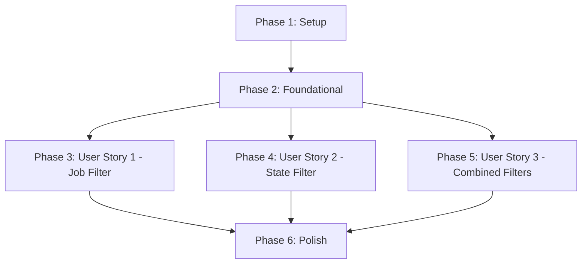

# Tasks: Targets Filter

**Input**: Design documents from `/specs/006-targets-filter/`
**Prerequisites**: plan.md (required), spec.md (required for user stories), research.md, data-model.md, contracts/

**Tests**: Test tasks included following TDD approach per project constitution.

**Organization**: Tasks are grouped by user story to enable independent implementation and testing of each story.

## Format: `[ID] [P?] [Story] Description`

- **[P]**: Can run in parallel (different files, no dependencies)
- **[Story]**: Which user story this task belongs to (e.g., US1, US2, US3)
- Include exact file paths in descriptions

## Path Conventions

- **Single project**: `src/`, `tests/` at repository root
- Paths assume existing prom-cli structure from plan.md

## Phase 1: Setup (Shared Infrastructure)

**Purpose**: Project initialization and type definitions shared across all user stories

**Tasks**:

- [x] T001 Add filter option types to TargetsOptions interface in src/commands/targets.ts
- [x] T002 [P] Create test file tests/targets.test.ts with mock data setup
- [x] T003 [P] Verify TypeScript compilation with new types (pnpm build)

**Checkpoint**: Type definitions in place, test infrastructure ready

---

## Phase 2: Foundational (Blocking Prerequisites)

**Purpose**: Core filterTargets() function that ALL user stories depend on

**⚠️ CRITICAL**: No user story work can begin until this phase is complete

**Tasks**:

- [ ] T004 Write failing unit tests for filterTargets() function in tests/targets.test.ts (TDD Red phase)
- [ ] T005 Implement filterTargets() function in src/commands/targets.ts (TDD Green phase)
- [ ] T006 Export filterTargets() from src/commands/targets.ts for testing
- [ ] T007 Verify all filterTargets() unit tests pass (pnpm test targets.test.ts)

**Checkpoint**: Foundation ready - filterTargets() function tested and working

---

## Phase 3: User Story 1 - Filter Targets by Job (Priority: P1) 🎯 MVP

**Goal**: Users can filter targets by job name using `--job` option

**Independent Test**: Run `prom targets --job prometheus` and verify only prometheus job targets are shown

### Tests for User Story 1

> **NOTE: Write these tests FIRST, ensure they FAIL before implementation**

- [ ] T008 [P] [US1] Add test case for filtering by job name in tests/targets.test.ts
- [ ] T009 [P] [US1] Add test case for nonexistent job name (empty result) in tests/targets.test.ts
- [ ] T010 [P] [US1] Add test case for job filter with JSON output in tests/targets.test.ts

### Implementation for User Story 1

- [ ] T011 [US1] Add `--job <name>` option to command definition in src/commands/targets.ts
- [ ] T012 [US1] Apply job filter in command action (call filterTargets with job option) in src/commands/targets.ts
- [ ] T013 [US1] Update help text to document --job option
- [ ] T014 [US1] Handle empty results case for job filter (display "No targets found matching filters.")
- [ ] T015 [US1] Verify all User Story 1 tests pass (pnpm test)

**Manual Verification**:

```bash
pnpm build
prom targets --job prometheus
prom targets --job nonexistent
prom targets --job prometheus --json
```

**Checkpoint**: User Story 1 complete - job filtering fully functional and tested

---

## Phase 4: User Story 2 - Filter Targets by Health State (Priority: P2)

**Goal**: Users can filter targets by health state using `--state` option

**Independent Test**: Run `prom targets --state down` and verify only unhealthy targets are shown

### Tests for User Story 2

> **NOTE: Write these tests FIRST, ensure they FAIL before implementation**

- [ ] T016 [P] [US2] Add test case for filtering by state "up" in tests/targets.test.ts
- [ ] T017 [P] [US2] Add test case for filtering by state "down" in tests/targets.test.ts
- [ ] T018 [P] [US2] Add test case for empty results when no targets match state in tests/targets.test.ts
- [ ] T019 [P] [US2] Add test case for invalid state value (error handling) in tests/targets.test.ts

### Implementation for User Story 2

- [ ] T020 [US2] Add `--state <state>` option to command definition in src/commands/targets.ts
- [ ] T021 [US2] Add state option validation (must be "up" or "down") before API call in src/commands/targets.ts
- [ ] T022 [US2] Add error message for invalid state value
- [ ] T023 [US2] Apply state filter in command action (call filterTargets with state option) in src/commands/targets.ts
- [ ] T024 [US2] Update help text to document --state option
- [ ] T025 [US2] Verify all User Story 2 tests pass (pnpm test)

**Manual Verification**:

```bash
pnpm build
prom targets --state up
prom targets --state down
prom targets --state invalid  # Should show error
```

**Checkpoint**: User Story 2 complete - state filtering fully functional and tested

---

## Phase 5: User Story 3 - Combine Multiple Filters (Priority: P3)

**Goal**: Users can combine job and state filters for advanced troubleshooting

**Independent Test**: Run `prom targets --job node-exporter --state down` and verify only matching targets are shown

### Tests for User Story 3

> **NOTE: Write these tests FIRST, ensure they FAIL before implementation**

- [ ] T026 [P] [US3] Add test case for combined job and state filters in tests/targets.test.ts
- [ ] T027 [P] [US3] Add test case for combined filters with JSON output in tests/targets.test.ts
- [ ] T028 [P] [US3] Add test case for combined filters with no matches in tests/targets.test.ts

### Implementation for User Story 3

- [ ] T029 [US3] Update filterTargets() application to pass both job and state options in src/commands/targets.ts
- [ ] T030 [US3] Verify AND logic works correctly for combined filters (existing filterTargets already supports this)
- [ ] T031 [US3] Verify all User Story 3 tests pass (pnpm test)

**Manual Verification**:

```bash
pnpm build
prom targets --job node-exporter --state down
prom targets --job prometheus --state up --json
prom targets --job prometheus --state down  # Likely no matches
```

**Checkpoint**: User Story 3 complete - combined filtering fully functional and tested

---

## Phase 6: Polish & Cross-Cutting Concerns

**Purpose**: Final quality checks, documentation, and cross-cutting improvements

**Tasks**:

- [ ] T032 [P] Run full test suite and verify all 121+ tests pass (pnpm test)
- [ ] T033 [P] Run linting and formatting checks (pnpm format)
- [ ] T034 [P] Build project and verify no TypeScript errors (pnpm build)
- [ ] T035 [P] Update THOUGHTS.md with implementation notes
- [ ] T036 [P] Verify backward compatibility (existing `prom targets` works without filters)
- [ ] T037 Manual testing with real Prometheus server (all scenarios from quickstart.md)

**Final Checkpoint**: All tests pass, code formatted, feature ready for PR

---

## Dependencies

### User Story Completion Order



**Key Dependencies**:

- **Foundational → All User Stories**: filterTargets() function must be complete before any user story implementation
- **US1 and US2 are independent**: Can be implemented in any order after Foundational phase
- **US3 depends on US1 and US2 conceptually**: But implementation-wise, only depends on Foundational phase (filterTargets() already supports both filters)

### Parallel Opportunities

**Phase 1 (Setup)**:

```bash
# All setup tasks can run in parallel
Task: T001 [P] Type definitions
Task: T002 [P] Test file creation
Task: T003 [P] TypeScript compilation check
```

**Phase 2 (Foundational) - Sequential (TDD)**:

```bash
# Must run in order: Test → Implementation → Verify
Task: T004 Write failing tests
Task: T005 Implement filterTargets()
Task: T006 Export function
Task: T007 Verify tests pass
```

**Phase 3 (User Story 1 Tests)**:

```bash
# All US1 test tasks can run in parallel
Task: T008 [P] [US1] Job filter test
Task: T009 [P] [US1] Nonexistent job test
Task: T010 [P] [US1] JSON output test
```

**Phase 4 (User Story 2 Tests)**:

```bash
# All US2 test tasks can run in parallel
Task: T016 [P] [US2] State "up" test
Task: T017 [P] [US2] State "down" test
Task: T018 [P] [US2] Empty results test
Task: T019 [P] [US2] Invalid state test
```

**Phase 5 (User Story 3 Tests)**:

```bash
# All US3 test tasks can run in parallel
Task: T026 [P] [US3] Combined filters test
Task: T027 [P] [US3] Combined with JSON test
Task: T028 [P] [US3] No matches test
```

**Phase 6 (Polish)**:

```bash
# All polish tasks can run in parallel
Task: T032 [P] Run tests
Task: T033 [P] Format code
Task: T034 [P] Build check
Task: T035 [P] Update docs
Task: T036 [P] Backward compat check
```

---

## Implementation Strategy

### MVP Scope (Recommended First Delivery)

**Minimum Viable Product**: Phase 1 + Phase 2 + **Phase 3 (User Story 1 only)**

This delivers:

- ✅ Filter targets by job name
- ✅ Full test coverage for job filtering
- ✅ Backward compatible (no breaking changes)
- ✅ Independently testable and deployable

**Rationale**: Job filtering is the most common use case (P1 priority) and provides immediate value. Ship this first, gather feedback, then add state filtering (P2) and combined filtering (P3) in subsequent iterations.

### Incremental Delivery Plan

**Sprint 1 (MVP)**: Phases 1-3

- Deliver job filtering capability
- Create PR, get feedback, merge

**Sprint 2**: Phase 4

- Add state filtering
- Create PR, merge

**Sprint 3**: Phase 5-6

- Add combined filtering
- Final polish
- Create PR, merge

### Task Execution Guidelines

1. **Follow TDD strictly**: Write tests first (Red), implement (Green), refactor if needed
2. **Commit after each task**: Per constitution Git Commit Standards
3. **Run tests frequently**: After every few tasks, not just at end
4. **One user story at a time**: Complete US1 fully before starting US2
5. **Manual verification**: Test with real Prometheus server at each checkpoint

---

## Task Metadata

**Total Tasks**: 37 tasks across 6 phases
**Estimated Effort**: ~4-6 hours (with TDD and testing)

**Task Breakdown by Phase**:

- Phase 1 (Setup): 3 tasks
- Phase 2 (Foundational): 4 tasks (blocking)
- Phase 3 (US1): 8 tasks (3 tests + 5 implementation)
- Phase 4 (US2): 10 tasks (4 tests + 6 implementation)
- Phase 5 (US3): 6 tasks (3 tests + 3 implementation)
- Phase 6 (Polish): 6 tasks

**Parallel Opportunities**: 18 tasks marked [P] can run in parallel with their peers

**Independent User Stories**:

- ✅ US1 (Job Filter): Can be implemented and delivered independently
- ✅ US2 (State Filter): Can be implemented and delivered independently
- ✅ US3 (Combined): Requires US1+US2 conceptually, but technically only depends on Foundational phase

---

## Notes

- **TDD Approach**: All tests written before implementation per project constitution
- **Backward Compatibility**: Feature is purely additive (new options), zero breaking changes
- **File Modifications**: Only 2 files modified (src/commands/targets.ts, src/types/index.ts), 1 new test file (tests/targets.test.ts)
- **Existing Code Reuse**: Leverages existing getTargets(), formatters, error handlers
- **Performance**: Client-side filtering is trivial for typical target counts (< 1000)
- **Constitution Compliance**: All principles verified in plan.md Constitution Check
