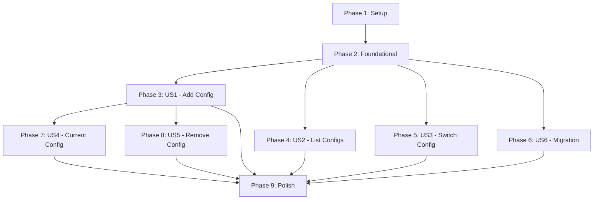

# Tasks: Multi-Config Management

**Input**: Design documents from `/specs/007-multi-config/`
**Prerequisites**: plan.md, spec.md, research.md, data-model.md, contracts/cli-commands.md, quickstart.md

**Tests**: Included throughout - feature requires TDD/BDD approach per constitution

**Organization**: Tasks are grouped by user story to enable independent implementation and testing of each story.

## Format: `[ID] [P?] [Story] Description`

- **[P]**: Can run in parallel (different files, no dependencies)
- **[Story]**: Which user story this task belongs to (e.g., US1, US2, US3)
- Include exact file paths in descriptions

## Path Conventions

Single project structure (prom-cli is a CLI tool):

- Source: `src/commands/`, `src/services/`, `src/types/`
- Tests: `tests/`

---

## Phase 1: Setup (Shared Infrastructure)

**Purpose**: Define TypeScript types for multi-config structure

**Tasks**:

- [ ] T001 [P] Add Configuration interface to src/types/index.ts
- [ ] T002 [P] Add ConfigStore interface to src/types/index.ts
- [ ] T003 Verify TypeScript compilation with new types (pnpm build)

**Checkpoint**: Type definitions in place, compilation successful

---

## Phase 2: Foundational (Blocking Prerequisites)

**Purpose**: Core ConfigStore and migration modules that ALL user stories depend on

**⚠️ CRITICAL**: No user story work can begin until this phase is complete

### ConfigStore Module (Core Operations)

- [ ] T004 [P] Create tests/config-store.test.ts with test setup and teardown (TDD Red)
- [ ] T005 [P] Write failing test for loadConfigStore() with no file in tests/config-store.test.ts
- [ ] T006 [P] Write failing test for addConfiguration() first config becomes active in tests/config-store.test.ts
- [ ] T007 [P] Write failing test for addConfiguration() second config remains inactive in tests/config-store.test.ts
- [ ] T008 [P] Write failing test for setActiveConfig() switches active in tests/config-store.test.ts
- [ ] T009 [P] Write failing test for removeConfiguration() inactive config in tests/config-store.test.ts
- [ ] T010 [P] Write failing test for listConfigurations() returns sorted names in tests/config-store.test.ts
- [ ] T011 Run tests to verify all fail (TDD Red phase - pnpm test config-store.test.ts)
- [ ] T012 Create src/services/config-store.ts with loadConfigStore() implementation
- [ ] T013 Implement saveConfigStore() with atomic write (temp file + rename) in src/services/config-store.ts
- [ ] T014 Implement addConfiguration() function in src/services/config-store.ts
- [ ] T015 Implement removeConfiguration() function in src/services/config-store.ts
- [ ] T016 Implement setActiveConfig() function in src/services/config-store.ts
- [ ] T017 Implement getActiveConfig() function in src/services/config-store.ts
- [ ] T018 Implement listConfigurations() function in src/services/config-store.ts
- [ ] T019 Run tests to verify all pass (TDD Green phase - pnpm test config-store.test.ts)
- [ ] T020 Export all functions from src/services/config-store.ts

### Migration Module

- [ ] T021 [P] Create tests/config-migration.test.ts with migration test scenarios
- [ ] T022 [P] Write failing test for detectOldFormat() identifies old format in tests/config-migration.test.ts
- [ ] T023 [P] Write failing test for detectOldFormat() identifies new format in tests/config-migration.test.ts
- [ ] T024 [P] Write failing test for migrateOldConfig() creates default config in tests/config-migration.test.ts
- [ ] T025 [P] Write failing test for migrateOldConfig() preserves all auth fields in tests/config-migration.test.ts
- [ ] T026 Run tests to verify all fail (TDD Red phase - pnpm test config-migration.test.ts)
- [ ] T027 Create src/services/config-migration.ts with detectOldFormat() implementation
- [ ] T028 Implement migrateOldConfig() function in src/services/config-migration.ts
- [ ] T029 Implement backupOldConfig() function in src/services/config-migration.ts
- [ ] T030 Run tests to verify all pass (TDD Green phase - pnpm test config-migration.test.ts)
- [ ] T031 Export all functions from src/services/config-migration.ts

**Checkpoint**: Foundation ready - ConfigStore and migration modules fully functional and tested

---

## Phase 3: User Story 1 - Add Named Configuration (Priority: P1) 🎯 MVP

**Goal**: Enable users to add named configurations for multiple Prometheus servers

**Independent Test**: Can be fully tested by running `prom config add <name> <url>` and verifying the configuration is stored

### Tests for User Story 1

> **NOTE: Write these tests FIRST, ensure they FAIL before implementation**

- [ ] T032 [P] [US1] Write failing test for config add with no args shows error in tests/config.test.ts
- [ ] T033 [P] [US1] Write failing test for config add creates first config as active in tests/config.test.ts
- [ ] T034 [P] [US1] Write failing test for config add with basic auth stores credentials in tests/config.test.ts
- [ ] T035 [P] [US1] Write failing test for config add with bearer token stores token in tests/config.test.ts
- [ ] T036 [P] [US1] Write failing test for config add duplicate name shows error in tests/config.test.ts
- [ ] T037 [P] [US1] Write failing test for config add invalid URL shows error in tests/config.test.ts
- [ ] T038 [P] [US1] Write failing test for config add username without password shows error in tests/config.test.ts
- [ ] T039 [P] [US1] Write failing test for config add both token and username shows error in tests/config.test.ts
- [ ] T040 Run tests to verify User Story 1 tests fail (pnpm test config.test.ts)

### Implementation for User Story 1

- [ ] T041 [US1] Add validateConfigName() function to src/services/config-store.ts
- [ ] T042 [US1] Add validateServerUrl() function to src/services/config-store.ts
- [ ] T043 [US1] Add validateAuthentication() function to src/services/config-store.ts
- [ ] T044 [US1] Extend config command with add subcommand in src/commands/config.ts
- [ ] T045 [US1] Implement config add command action handler in src/commands/config.ts
- [ ] T046 [US1] Add validation calls in config add action (name, URL, auth) in src/commands/config.ts
- [ ] T047 [US1] Add error handling for duplicate config names in src/commands/config.ts
- [ ] T048 [US1] Add success message for config add in src/commands/config.ts
- [ ] T049 [US1] Run tests to verify User Story 1 tests pass (pnpm test config.test.ts)

**Manual Verification**:

```bash
pnpm build
prom config add dev http://localhost:9090
prom config add prod https://prod.example.com --username admin --password secret
prom config add staging https://staging.example.com --token abc123
```

**Checkpoint**: User Story 1 complete - users can add named configurations with authentication

---

## Phase 4: User Story 2 - List All Configurations (Priority: P1)

**Goal**: Enable users to see all saved configurations with active indicator

**Independent Test**: Can be fully tested by running `prom config list` and verifying all configurations displayed

### Tests for User Story 2

- [ ] T050 [P] [US2] Write failing test for config list with no configs shows guidance in tests/config.test.ts
- [ ] T051 [P] [US2] Write failing test for config list shows all configs sorted in tests/config.test.ts
- [ ] T052 [P] [US2] Write failing test for config list marks active config in tests/config.test.ts
- [ ] T053 [P] [US2] Write failing test for config list masks authentication in tests/config.test.ts
- [ ] T054 Run tests to verify User Story 2 tests fail (pnpm test config.test.ts)

### Implementation for User Story 2

- [ ] T055 [US2] Add maskCredentials() helper function to src/commands/config.ts
- [ ] T056 [US2] Add formatConfigList() helper function to src/commands/config.ts
- [ ] T057 [US2] Add config list subcommand to config command in src/commands/config.ts
- [ ] T058 [US2] Implement config list command action handler in src/commands/config.ts
- [ ] T059 [US2] Add table formatting for configuration list in src/commands/config.ts
- [ ] T060 [US2] Add empty state message for no configurations in src/commands/config.ts
- [ ] T061 [US2] Run tests to verify User Story 2 tests pass (pnpm test config.test.ts)

**Manual Verification**:

```bash
pnpm build
prom config list
```

**Checkpoint**: User Story 2 complete - users can list all configurations with active indicator

---

## Phase 5: User Story 3 - Switch Active Configuration (Priority: P1)

**Goal**: Enable users to switch between saved configurations quickly

**Independent Test**: Can be fully tested by running `prom config use <name>` and verifying subsequent commands use switched config

### Tests for User Story 3

- [ ] T062 [P] [US3] Write failing test for config use switches active config in tests/config.test.ts
- [ ] T063 [P] [US3] Write failing test for config use nonexistent shows error in tests/config.test.ts
- [ ] T064 [P] [US3] Write failing test for config use shows success message in tests/config.test.ts
- [ ] T065 [P] [US3] Write failing test for existing commands use switched config in tests/config.test.ts
- [ ] T066 Run tests to verify User Story 3 tests fail (pnpm test config.test.ts)

### Implementation for User Story 3

- [ ] T067 [US3] Add config use subcommand to config command in src/commands/config.ts
- [ ] T068 [US3] Implement config use command action handler in src/commands/config.ts
- [ ] T069 [US3] Add validation for config name exists in src/commands/config.ts
- [ ] T070 [US3] Add success message showing switched config details in src/commands/config.ts
- [ ] T071 [US3] Add error message with available configs list in src/commands/config.ts
- [ ] T072 [US3] Run tests to verify User Story 3 tests pass (pnpm test config.test.ts)

**Manual Verification**:

```bash
pnpm build
prom config use prod
prom targets  # Should query production server
prom config use staging
prom targets  # Should query staging server
```

**Checkpoint**: User Story 3 complete - users can switch between configurations seamlessly

---

## Phase 6: User Story 6 - Backward Compatibility Migration (Priority: P1)

**Goal**: Automatically migrate old single-config format to new multi-config format

**Independent Test**: Can be fully tested by placing old config.json file, running any command, and verifying migration occurs

### Tests for User Story 6

- [ ] T073 [P] [US6] Write failing test for old format auto-migrates on loadConfig() in tests/config.test.ts
- [ ] T074 [P] [US6] Write failing test for migration creates default config in tests/config.test.ts
- [ ] T075 [P] [US6] Write failing test for migration preserves all auth fields in tests/config.test.ts
- [ ] T076 [P] [US6] Write failing test for migration creates backup file in tests/config.test.ts
- [ ] T077 [P] [US6] Write failing test for migration displays success message in tests/config.test.ts
- [ ] T078 Run tests to verify User Story 6 tests fail (pnpm test config.test.ts)

### Implementation for User Story 6

- [ ] T079 [US6] Refactor loadConfig() in src/services/config.ts to detect old format
- [ ] T080 [US6] Integrate detectOldFormat() call in loadConfig() in src/services/config.ts
- [ ] T081 [US6] Integrate backupOldConfig() call on migration in src/services/config.ts
- [ ] T082 [US6] Integrate migrateOldConfig() call in loadConfig() in src/services/config.ts
- [ ] T083 [US6] Add migration success message in loadConfig() in src/services/config.ts
- [ ] T084 [US6] Update loadConfig() to use getActiveConfig() for multi-config in src/services/config.ts
- [ ] T085 [US6] Run tests to verify User Story 6 tests pass (pnpm test config.test.ts)

**Manual Verification**:

```bash
# Create old format config
echo '{"serverUrl":"http://localhost:9090","username":"admin","password":"secret"}' > ~/.prom-cli/config.json

# Run any command to trigger migration
prom targets

# Verify migration occurred
ls ~/.prom-cli/config.json.backup  # Backup should exist
prom config list  # Should show "default" config
```

**Checkpoint**: User Story 6 complete - backward compatibility ensured, existing users can upgrade without breaking changes

---

## Phase 7: User Story 4 - Show Current Configuration (Priority: P2)

**Goal**: Enable users to see which configuration is currently active and its details

**Independent Test**: Can be fully tested by running `prom config current` and verifying active config details displayed

### Tests for User Story 4

- [ ] T086 [P] [US4] Write failing test for config current shows active config in tests/config.test.ts
- [ ] T087 [P] [US4] Write failing test for config current masks credentials in tests/config.test.ts
- [ ] T088 [P] [US4] Write failing test for config current with no active shows message in tests/config.test.ts
- [ ] T089 Run tests to verify User Story 4 tests fail (pnpm test config.test.ts)

### Implementation for User Story 4

- [ ] T090 [US4] Add config current subcommand to config command in src/commands/config.ts
- [ ] T091 [US4] Implement config current command action handler in src/commands/config.ts
- [ ] T092 [US4] Add formatting for current config display in src/commands/config.ts
- [ ] T093 [US4] Add empty state message for no active config in src/commands/config.ts
- [ ] T094 [US4] Run tests to verify User Story 4 tests pass (pnpm test config.test.ts)

**Manual Verification**:

```bash
pnpm build
prom config current
```

**Checkpoint**: User Story 4 complete - users can see current active configuration details

---

## Phase 8: User Story 5 - Remove Configuration (Priority: P2)

**Goal**: Enable users to remove configurations they no longer need

**Independent Test**: Can be fully tested by running `prom config remove <name>` and verifying configuration deleted

### Tests for User Story 5

- [ ] T095 [P] [US5] Write failing test for config remove inactive config succeeds in tests/config.test.ts
- [ ] T096 [P] [US5] Write failing test for config remove active without force fails in tests/config.test.ts
- [ ] T097 [P] [US5] Write failing test for config remove active with force succeeds in tests/config.test.ts
- [ ] T098 [P] [US5] Write failing test for config remove nonexistent shows error in tests/config.test.ts
- [ ] T099 [P] [US5] Write failing test for config remove with --yes skips confirmation in tests/config.test.ts
- [ ] T100 Run tests to verify User Story 5 tests fail (pnpm test config.test.ts)

### Implementation for User Story 5

- [ ] T101 [US5] Add confirmAction() helper function for prompts to src/commands/config.ts
- [ ] T102 [US5] Add config remove subcommand to config command in src/commands/config.ts
- [ ] T103 [US5] Implement config remove command action handler in src/commands/config.ts
- [ ] T104 [US5] Add check for active config protection in src/commands/config.ts
- [ ] T105 [US5] Add confirmation prompt integration in src/commands/config.ts
- [ ] T106 [US5] Add --force flag handling for active config removal in src/commands/config.ts
- [ ] T107 [US5] Add success message for removal in src/commands/config.ts
- [ ] T108 [US5] Run tests to verify User Story 5 tests pass (pnpm test config.test.ts)

**Manual Verification**:

```bash
pnpm build
prom config remove staging
prom config remove prod --force --yes
```

**Checkpoint**: User Story 5 complete - users can safely remove configurations with confirmation

---

## Phase 9: Polish & Cross-Cutting Concerns

**Purpose**: Improvements that affect multiple user stories

- [ ] T109 [P] Add JSDoc comments to all exported functions in src/services/config-store.ts
- [ ] T110 [P] Add JSDoc comments to all exported functions in src/services/config-migration.ts
- [ ] T111 [P] Add JSDoc comments to config subcommands in src/commands/config.ts
- [ ] T112 [P] Update --help text for config command with subcommand examples in src/commands/config.ts
- [ ] T113 [P] Run prettier formatting (pnpm format)
- [ ] T114 [P] Run TypeScript compilation check (pnpm build)
- [ ] T115 [P] Run all tests to verify nothing broken (pnpm test)
- [ ] T116 Verify backward compatibility with existing commands (prom query, targets, labels, series, status all work)
- [ ] T117 Update CLAUDE.md with summary of multi-config changes
- [ ] T118 Manual testing with real Prometheus servers (production scenario)
- [ ] T119 Verify migration rollback scenario (restore from backup works)
- [ ] T120 Verify concurrent access scenario (no file corruption)

---

## Dependencies & Execution Order

### Phase Dependencies



**Key Dependencies**:

- **Setup → Foundational**: Types must exist before modules can use them
- **Foundational → All User Stories**: ConfigStore and migration are core dependencies
- **US1, US2, US3, US6 are independent** after Foundational: Can be implemented in parallel
- **US4 depends on US1**: Needs config add to have configs to show current
- **US5 depends on US1**: Needs config add to have configs to remove

### Parallel Opportunities

**Phase 1 (Setup)**:

```bash
# All setup tasks can run in parallel
Task: T001 [P] Add Configuration interface
Task: T002 [P] Add ConfigStore interface
```

**Phase 2 (Foundational) - Sequential within module, parallel between modules**:

```bash
# ConfigStore tests (write all in parallel):
Task: T004-T010 [P] Write all failing tests for ConfigStore

# Migration tests (write all in parallel):
Task: T021-T025 [P] Write all failing tests for migration
```

**Phase 3 (User Story 1) - Tests parallel, implementation sequential**:

```bash
# All US1 tests can be written in parallel:
Task: T032-T039 [P] Write all failing tests for config add
```

**Phases 3-6 (User Stories 1, 2, 3, 6) - Can run in parallel** after Foundational phase completes:

- Team Member A: Implement US1 (config add)
- Team Member B: Implement US2 (config list)
- Team Member C: Implement US3 (config use)
- Team Member D: Implement US6 (migration)

**Phase 9 (Polish)**:

```bash
# Most polish tasks can run in parallel:
Task: T109-T115 [P] Documentation, formatting, compilation
```

---

## Implementation Strategy

### MVP Scope (Minimum Viable Product)

**Recommended MVP**: Phase 1 + Phase 2 + Phase 3 (US1) + Phase 4 (US2) + Phase 5 (US3) + Phase 6 (US6)

This delivers:

- ✅ Add named configurations (US1)
- ✅ List configurations with active indicator (US2)
- ✅ Switch between configurations (US3)
- ✅ Automatic migration for backward compatibility (US6)
- ✅ Zero breaking changes for existing users
- ✅ Core multi-config workflow functional

**Rationale**: US1, US2, US3, US6 are all P1 priority and form the minimum set for multi-config functionality. Without any one of these, the feature is incomplete. US4 (current) and US5 (remove) are P2 and can be added in subsequent iterations.

### Incremental Delivery Plan

**Sprint 1 (MVP)**: Phases 1-6

- Deliver core multi-config functionality (add, list, use, migration)
- Create PR, get feedback, merge
- **Deliverable**: Users can manage multiple configs and switch between them

**Sprint 2 (Enhancement)**: Phases 7-8

- Add current command (US4)
- Add remove command (US5)
- Create PR, merge
- **Deliverable**: Complete configuration lifecycle management

**Sprint 3 (Polish)**: Phase 9

- Documentation, cleanup, edge case hardening
- Final manual testing
- Create PR, merge
- **Deliverable**: Production-ready multi-config feature

### Parallel Team Strategy

With multiple developers:

1. **Together**: Complete Setup + Foundational (critical path)
2. **In parallel** after Foundational:
   - Developer A: US1 (config add) - T032 through T049
   - Developer B: US2 (config list) - T050 through T061
   - Developer C: US3 (config use) - T062 through T072
   - Developer D: US6 (migration) - T073 through T085
3. **Sequential**: US4 and US5 depend on US1 being complete
4. **Together**: Polish phase

### Task Execution Guidelines

1. **Follow TDD strictly**: Write tests first (Red), implement (Green), refactor if needed
2. **Commit after each task or logical group**: Per constitution Git Commit Standards
3. **Run tests frequently**: After each implementation task
4. **Verify checkpoints**: Stop at each checkpoint to validate story independently
5. **Use constitution as guide**: Refer to code quality, testing, and no-overdesign principles

---

## Task Metadata

**Total Tasks**: 120 tasks across 9 phases
**Estimated Effort**: ~12-16 hours (with TDD and thorough testing)

**Task Breakdown by Phase**:

- Phase 1 (Setup): 3 tasks
- Phase 2 (Foundational): 28 tasks (ConfigStore: 17, Migration: 11)
- Phase 3 (US1 - Add): 18 tasks (9 tests + 9 implementation)
- Phase 4 (US2 - List): 12 tasks (5 tests + 7 implementation)
- Phase 5 (US3 - Use): 11 tasks (5 tests + 6 implementation)
- Phase 6 (US6 - Migration): 13 tasks (6 tests + 7 implementation)
- Phase 7 (US4 - Current): 9 tasks (4 tests + 5 implementation)
- Phase 8 (US5 - Remove): 14 tasks (6 tests + 8 implementation)
- Phase 9 (Polish): 12 tasks

**Parallel Opportunities**: 45 tasks marked [P] can run in parallel with their peers

**Independent User Stories**:

- ✅ US1 (Add Config): Can be implemented independently after Foundational
- ✅ US2 (List): Can be implemented independently after Foundational
- ✅ US3 (Use): Can be implemented independently after Foundational
- ✅ US6 (Migration): Can be implemented independently after Foundational
- ⚠️ US4 (Current): Depends on US1 for configs to display
- ⚠️ US5 (Remove): Depends on US1 for configs to remove

---

## Notes

- Tasks follow TDD/BDD approach as required by constitution
- Each user story is independently testable with clear checkpoints
- [P] marker indicates parallelizable tasks (different files, no dependencies)
- [Story] label (e.g., [US1]) maps task to specific user story for traceability
- All validation functions (name, URL, auth) are in Phase 3 to avoid premature abstraction
- Migration logic tested separately before integration in Phase 6
- Manual verification examples provided at each checkpoint
- Constitution compliance verified throughout (code quality, testing, UX, performance)
